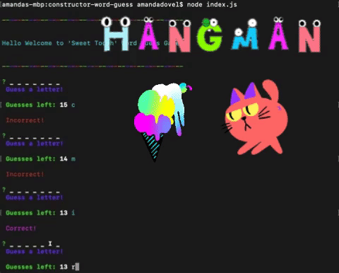
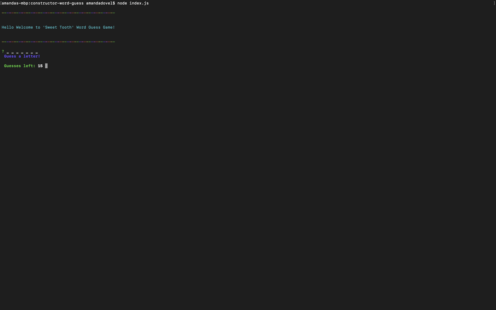
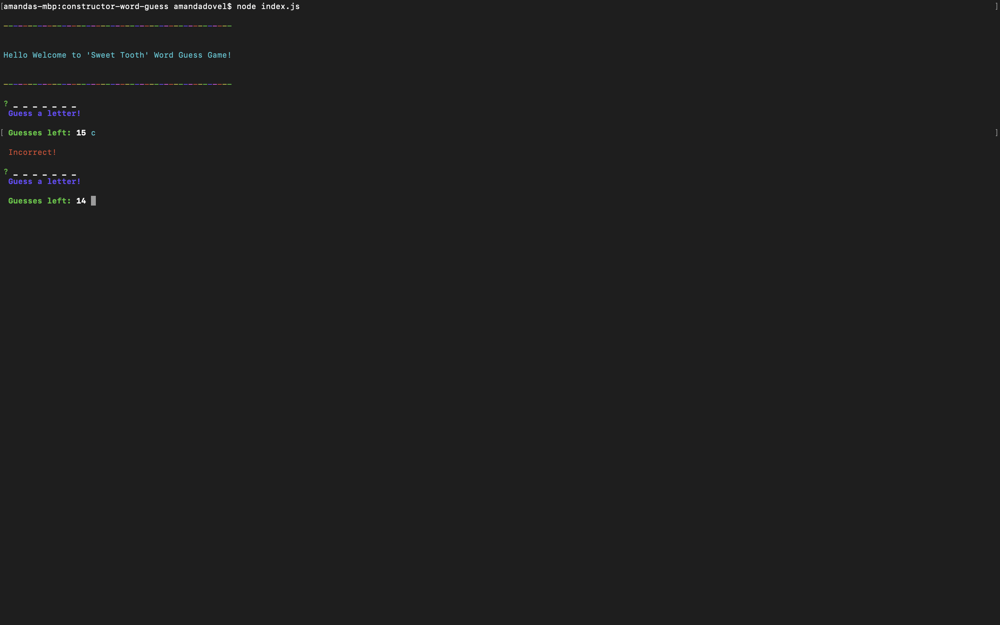
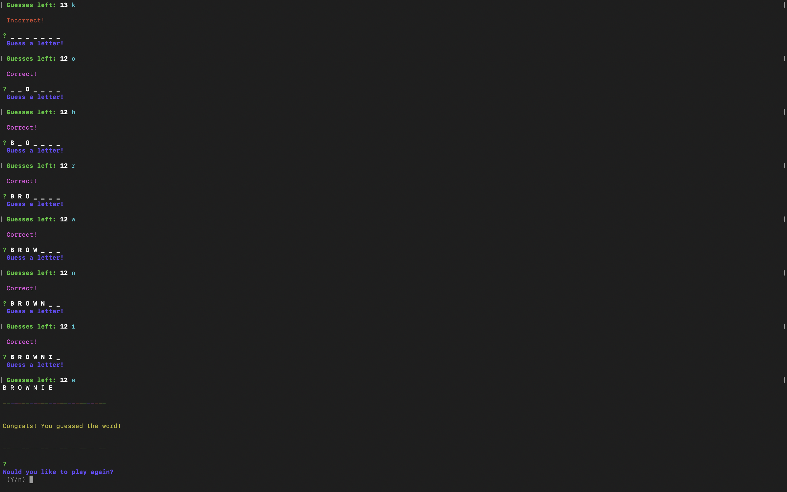

# constructor-word-guess 🍬

Using NPM packages and NodeJS I created a hangman game the user will play through the terminal. The theme for the game is sweet stuff. 



## Functionality 💪

#### Here's how the app works: 
1. letter.js: Contains a constructor, Letter. This constructor displays an underlying character or a blank placeholder (such as an underscore), depending on whether or not the user has guessed the letter. 

    1.1 The constructor defines: 
    - A string value to store the underlying character for the letter
    - A boolean value that stores whether that letter has been guessed yet
    - A function that returns the underlying character if the letter has been guessed, or a placeholder (like an underscore) if the letter has not been guessed
    - A function that takes a character as an argument and checks it against the underlying character, updating the stored boolean value to true if it was guessed correctly

```
this.renderLetter = function () {
        if (this.letter === " ") {
            return " ";
        } else {
            if (!this.isGuessed) {
                return "_";
            } else {
                return this.letter;
            }
        }
    }

    //A function that checks letter against underlying letter  
    // updates stored boolean value to true if it was guessed correctly
    this.checkLetter = function (guess) {
        if (guess.toUpperCase() === this.letter) {
            this.isGuessed = true;
            return true;

        }
    }

```



2. Word.js: Contains a constructor, Word that depends on the Letter constructor. This is used to create an object representing the current word the user is attempting to guess. 

    2.1 The constructor defines: 
    - An array of new Letter objects representing the letters of the underlying word
    - A function that returns a string representing the word. This should call the function on each letter object (the first function defined in Letter.js) that displays the character or an underscore and concatenate those together.
    - A function that takes a character as an argument and calls the guess function on each letter object (the second function defined in Letter.js)

```

function Word(word) {
    this.word = word;

    this.makeLetters = function () {
        let letters = [];
        let wordArray = this.word.split("");
        for (let i = 0; i < wordArray.length; i++) {
            let newLetter = new Letter(wordArray[i]);
            letters.push(newLetter);
        }
        return letters;
    }

    // 
    this.letters = this.makeLetters(this.word);
    // console.log(this.letters);

    // A makeGUESS function that takes a character as an argument
    // and calls the checkLetter function
    this.makeGuess = function (guess) {
        this.letters.forEach(letter => {
            letter.checkLetter(guess);
        });
        this.update();
    }

```



3. index.js: The file containing the logic for the course of the game, which depends on Word.js and letter.js. 
    
    3.1 index.js will do the following: 
    - Randomly selects a word and uses the Word constructor to store it
    - Prompts the user for each guess and keeps track of the user's remaining guesses

`node index.js`


```
// play game function
function playGame() {
    pickedWord = "";
    guesses = 15;
    if (pickedWords.length < wordBank.length) {
        pickedWord = getWord();
    } else {
        // Win condition
        console.log("\n-----------------\n".rainbow);
        console.log("\nCongrats you win!\n".magenta);
        console.log("\n-----------------\n".rainbow);
        continuePrompt();
    }
    if (pickedWord) {
        word = new Word(pickedWord);
        word.makeLetters();
        makeGuess();
    }
}


```



## Getting Started 🏁

These instructions will get you a copy of the project up and running on your local machine for grading and testing purposes. 

1. Clone repository. Click on the clone button next to the repository (clone with SSH). 
2. Open Terminal and git clone (paste) into directory of your choice. 
3. Open folder in VS Code. 
4. All 3 js files are stored in the constructor-word-guess directory.
5. `.gitignore` stores the files needed for running the application but are kept hidden to avoid unneccessarily pushing them to github. 

## Pre-Requisites ✔️

1. Node - use this site to install node into your computer: https://nodejs.org/en/download/
    *to check if node is installed type node -v into your terminal. If installed it will print the version number on the screen.
2. NPM - Node Package Manager. Use this site to assist in downloading packages or modules: https://www.npmjs.com/
    - user will need to download inquirer 


## Built With 🔧

* [Node](https://nodejs.org/en/download/) - As an asynchronous event driven JavaScript runtime, Node is designed to build scalable network applications. 
* [Javascript](https://www.javascript.com/) -JavaScript is the programming language of HTML and the Web
* [JSON](https://www.json.org/) - Javascript object notation, syntax for storing and exchanging information. 
* [NPM](https://www.npmjs.com/) - Online repository for publishing open-source Node.js projects


## Author ⌨️
*** Amanda Dovel *** - [amandadovel](https://github.com/amandadovel)
